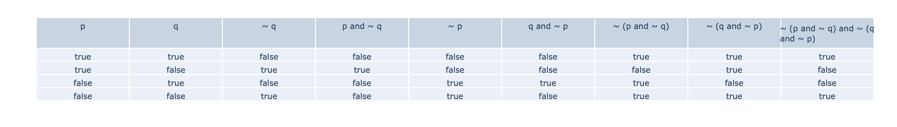

## Logic.py

Is a program that let you enter a logic proposition and show you his truth table

Here you enter the proposition

here the program show you the truth table using plotly.graph

I'm learning new conceps and trying to apply them in this personal project while I'm having fun
